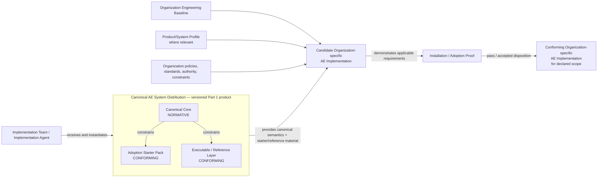
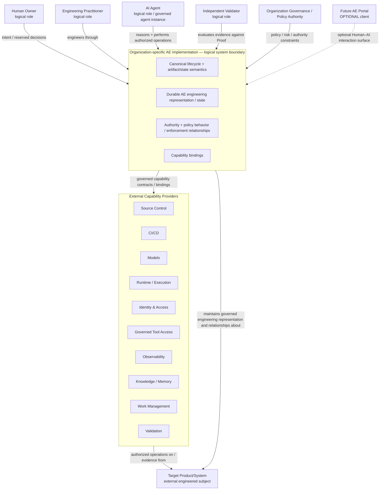

# L1-A — Architecture Context Views

**Status:** Approved L1-A baseline candidate pending repository review/merge  
**Architecture authority:** DR-021 (C4 is the adopted visual architecture model) remains below Contract v1.0 and may be superseded independently.

## 1. View strategy

AE needs two complementary context-level views because Part 1 distribution/adoption and operational use answer different engineering questions.

### Distribution / Adoption relationship view

This is a **complementary product/distribution relationship view**, not labeled a C4 System Context diagram.

Reason: the Canonical AE System Distribution is a versioned product/package containing normative and conforming material, not itself necessarily one running software system. Forcing it into C4 software-system terminology would obscure the product/adoption relationship.

### Operational Implementation view

This is the **C4 System Context view** for the logical Organization-specific AE Implementation as the system of interest. The implementation may be physically distributed across provider products while presenting one logical AE system boundary.

The current Markdown/Mermaid rendering is a repository visualization convenience, not a canonical notation choice. The semantic elements and relationships are the durable content.

---

## 2. Distribution / Adoption relationship view

### Key interpretation

- The **Canonical Core** is normative.
- The Starter Pack and Reference Layer conform to the Core.
- An organization creates an organization-specific implementation by binding canonical semantics to its own baseline and configuration.
- Candidate → Conforming is evidence-backed but does not imply external certification.

---

## 3. Operational Organization-specific AE Implementation — C4 System Context

**System of interest:** the logical Organization-specific AE Implementation.

## 4. Boundary rules made visible by the views

1. **Distributed implementation remains one logical AE system.** Provider products can remain physically separate.
2. **Capability Providers are not themselves the AE System.** They participate through canonical Capability Contracts.
3. **Target Product/System remains external.** AE owns/maintains governed engineering representation/state about it where appropriate.
4. **Portal is optional.** Removing it must not break canonical AE operation.
5. **Documentation alone does not satisfy the logical boundary.** Canonical operation requires executable capabilities, agent-operable interfaces where required, enforcement, durable state, and Validation behavior.
6. **Conformance is scoped and evidence-backed.** It is not certification.

## 5. Adopter use

An implementation team uses these views to answer:

- what it received from Part 1;
- what it must instantiate;
- which things are canonical versus organization-owned;
- which products are providers rather than AE itself;
- how a physically distributed implementation can still form one logical AE system;
- how the Target Product/System relates to AE without becoming an AE component.
