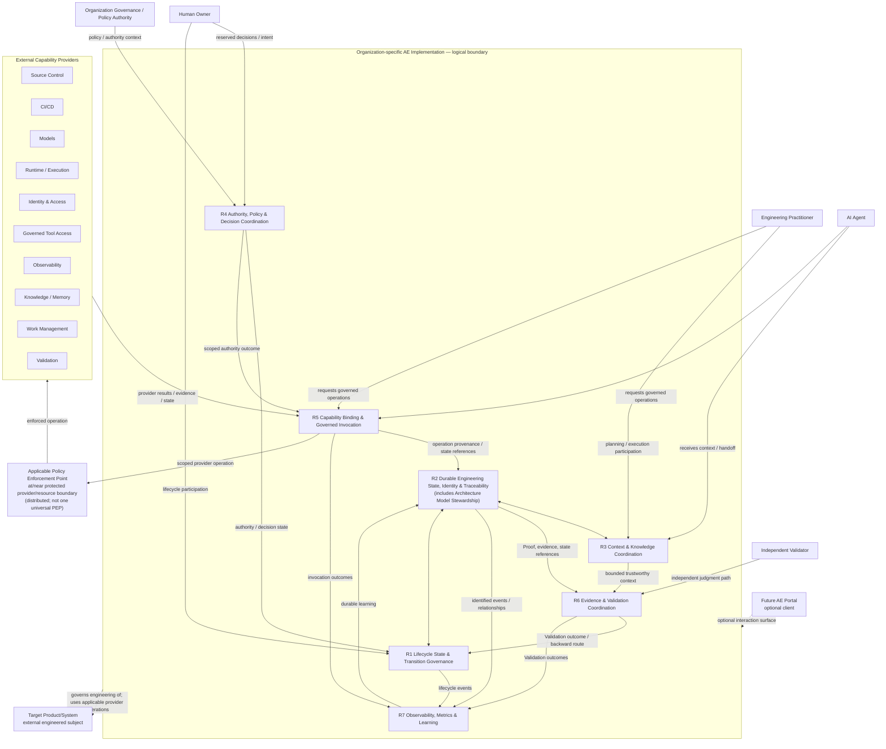
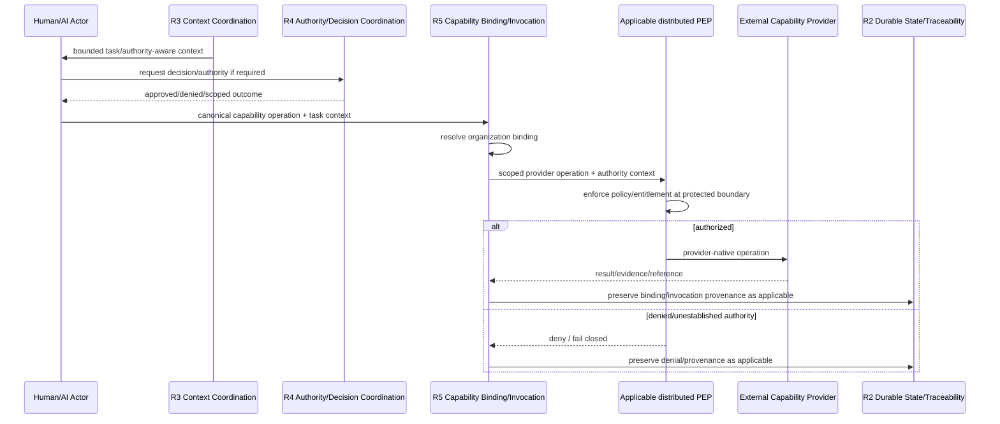
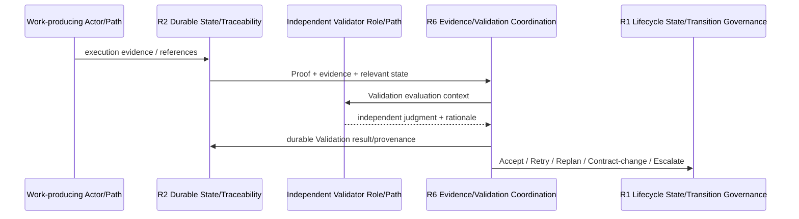

# L1-B — Logical Responsibility Architecture

**Status:** Approved L1-B baseline  
**Scope:** Normative logical responsibility relationships for the Canonical Core. This is not a C4 Container diagram and does not prescribe deployable topology.

## 1. Architecture intent

The operational Organization-specific AE Implementation remains the logical system of interest established in L1-A.

L1-B decomposes that logical system into **canonical responsibilities**, not services. The architecture must remain valid when one organization combines responsibilities into one platform and another distributes the same responsibilities across several systems and providers.

## 2. Normative logical responsibility view

The PEP node is a **conceptual relationship placeholder**. Different capability operations may be enforced by different provider-, broker-, runtime-, or resource-local PEPs.

## 3. Interpretation rules

1. **Boxes R1–R7 are responsibilities, not deployment units.** No box implies a service, microservice, agent persona, database, workflow engine, gateway, or network hop.
2. **Planning and Execution are lifecycle behaviors.** Planning/execution actors use the responsibilities and capability bindings; there is no canonical Planner/Executor component.
3. **R4 decision coordination and PEP enforcement are distinct.** R4 determines/preserves authority and policy outcomes. Enforcement can occur in a provider, broker, runtime, protected resource, or other boundary; there is no canonical universal PEP.
4. **R5 does not imply a universal gateway.** Direct governed integrations, adapters, MCP, APIs, brokers, agent-runtime tooling, and distributed mechanisms can realize the same canonical binding/invocation semantics.
5. **R2 is not a central database.** It establishes semantic ownership, identity, provenance, and traceability across potentially federated systems of record.
6. **Architecture remains first-class.** Architecture Model Stewardship is a named R2 sub-responsibility and supplies architecture state to R3/R6 and lifecycle work.
7. **R6 independence is logical.** The Validation judgment path must be independent from the work-producing execution path; physical separation is risk/policy dependent and is designed later.
8. **The Portal remains optional.** Human decisions and lifecycle operation must remain possible without it.
9. **Target Product/System remains external.** AE governs engineering of the target while maintaining durable engineering representation/state about it.
10. **External Capability Providers remain separate products/services.** Their physical boundary does not remove them from AE operational participation.

## 4. Protected-operation interaction

The canonical semantics for a protected provider operation are approximately:

The implementation can distribute every participant above. The sequence expresses required semantics, not mandatory network architecture. The applicable PEP can differ by provider, resource, operation, environment, or policy boundary.

## 5. Independent Validation interaction

The work-producing actor may perform self-checks and Verification. Those activities do not replace the independent Validation judgment path.

## 6. Human Decision Authority interaction without Portal dependency

A consequential Human decision must be able to flow through any suitable interface while preserving canonical semantics:

`proposal/rationale → eligible Human authority → authenticated approval/rejection → durable provenance → R1 transition gate and/or R5 protected-operation gate`

The interface may be CLI, API, Work Management, source-controlled artifact, enterprise approval product, future Portal, or another organization-selected mechanism.

## 7. Portability test

The same responsibility architecture must support at least these kinds of mappings:

- a compact implementation in which an agent platform plus source control/work management realizes several responsibilities together;
- a distributed enterprise implementation in which lifecycle, identity/policy, state, provider adapters, observability, and validation are spread across multiple systems.

If both preserve R1–R7 semantics, capability contracts, authority/enforcement, durable state, evidence/Validation, and adoption Proof, both can remain recognizably AE.
