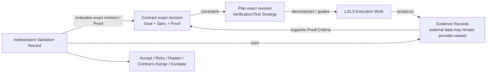
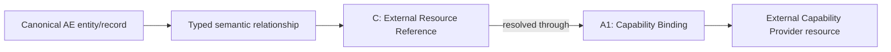
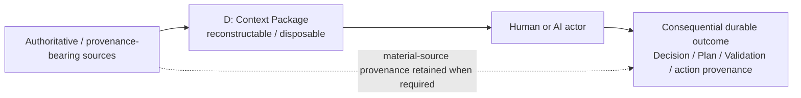

# L1-C — Domain Relationship View

**Status:** Approved L1-C semantic baseline  
**Scope:** Architecture-neutral semantic view. Boxes are domain concepts, not services, files, tables, schemas, or repositories.

## 1. Domain relationship view

```mermaid
flowchart TB
    RELEASE["F: Canonical AE Release Manifest"]
    OEB["A1: Organization Engineering Baseline"]
    PSP["A1: Product/System Profile"]
    IMPL["A1: AE Implementation Profile"]
    BIND["A1: Capability Binding"]
    ADVAL["A2: Validation Record\ninstallation/adoption use"]

    BASE["A1: Product/System Baseline — L1"]
    ARCH["A1: Architecture Model"]
    ADR["A2: Decision Record / ADR"]
    LEARN["A2: Learning Record"]

    LOOP["A1: AE Loop"]
    CONTRACT["A1: Contract\nGoal + Spec + Proof"]
    CCP["A1: Contract Change Proposal"]
    AUTH["A2: Authority Decision"]
    PLAN["A1: Plan"]
    PREVIEW["A2: Plan Review Record"]
    INC["A1: Execution Increment — L2"]
    TASK["A1: Executable Task — L3"]
    WORKREF["C: External Work Resource Reference"]
    L4["E: Agent micro-plan"]

    EVID["A2: Evidence Record"]
    EREF["C: External Evidence Resource Reference"]
    VAL["A2: Validation Record"]
    HAND["A2: Handoff Record"]
    CTX["D: Context Package"]
    EXP["A1: Experiment"]

    RELEASE -->|implemented by / exact release reference| IMPL
    OEB -->|used by exact revision| IMPL
    PSP -->|used by exact revision| IMPL
    BIND -->|used by exact revision| IMPL
    ADVAL -->|evaluates exact adoption inputs| IMPL
    ADVAL -->|supports conformance projection| IMPL

    PSP -->|constituent reference| BASE
    ARCH -->|constituent reference| BASE
    ADR -->|constituent / informs| BASE
    LEARN -->|may inform| BASE

    LOOP -->|uses exact revision| CONTRACT
    LOOP -->|uses exact revision| PLAN
    LOOP -->|plans against exact revision| BASE
    PLAN -->|derives from exact revision| CONTRACT
    PLAN -->|plans against| BASE
    PLAN -->|affects elements in| ARCH
    PLAN -->|reviewed by| PREVIEW
    PLAN -->|decomposes to| INC
    INC -->|decomposes to| TASK
    TASK -->|realized by| WORKREF
    L4 -.->|ephemeral execution planning| TASK

    CONTRACT -->|change proposed by| CCP
    AUTH -->|disposes / approves-rejects| CCP
    CCP -->|if approved produces new revision| CONTRACT

    TASK -->|produces / relates to| EVID
    EVID -->|may reference bytes/data in| EREF
    EVID -->|supports Proof Criteria in| CONTRACT
    VAL -->|evaluates exact revision| CONTRACT
    VAL -->|uses| EVID
    VAL -->|routes outcome for| LOOP

    CTX -.->|derived context for work in| LOOP
    HAND -->|continues| LOOP
    HAND -->|references authoritative state| PLAN
    HAND -->|references authoritative state| TASK

    EXP -->|produces| LEARN
    LOOP -->|may produce| LEARN
    VAL -->|failure may produce| LEARN
    LEARN -->|informs| ADR
```

**Installation/adoption Validation above is not an additional A2 type. It is the existing A2 Validation Record semantics applied to adoption/conformance Proof.**

## 2. Interpretation rules

1. **AE Loop correlates; it does not own the world.** Baseline, Architecture, OEB, Product/System Profile, DR/ADRs and Learning persist independently across Loops.
2. **Product/System Baseline is the L1 domain entity.** A Baseline Manifest is a representation/snapshot of an exact Baseline revision and is not shown as a competing entity.
3. **Plan representations are not separate Plan entities.** Human/machine/interactive forms represent one Plan revision.
4. **L3 Task is not a provider Work Item.** The provider resource is reached through an External Resource Reference; provider-authoritative properties remain external as declared.
5. **L4 is ephemeral by default.** Material state is promoted into the correct durable semantic object.
6. **Context Package is derived.** It may be discarded; consequential context provenance must remain reconstructable where required.
7. **Handoff Record is durable.** It points back to authoritative state and does not replace it.
8. **Evidence Record is canonical metadata/provenance, not copied evidence bytes.** Evidence can remain provider-owned.
9. **Conformance is Validation-backed.** AE Implementation Profile cannot make itself conforming through an editable field.
10. **Architecture Model is not a diagram file.** Architecture Elements/Relationships are subordinate addressable objects; representations vary.

## 3. Contract / Plan / Proof / Verification / Validation chain

Proof stays in Contract. Planning owns the Verification/Test Strategy. Validation is an independent judgment path.

## 4. Provider-authority pattern

The canonical object preserves AE identity/meaning. The provider can remain authoritative for selected external properties.

## 5. Context provenance pattern

L1-G will decide the minimal durable mechanism. L1-C establishes only that derived context may be disposable while material provenance cannot be lost when it materially informed a governed outcome.

## 6. Heterogeneous working-environment boundary

This domain model does not introduce an engineering-environment entity or assume one interface.

Open issue **#6** asks how humans/agents in heterogeneous IDEs, Dev Containers, terminals, cloud workspaces, CI/headless runtimes, or other environments discover and use the correct AE Implementation Profile, Contract, Plan, Baseline, architecture, capability bindings, authority, and context.

Principle preserved:

> **AE should require interface parity, not environment uniformity.**